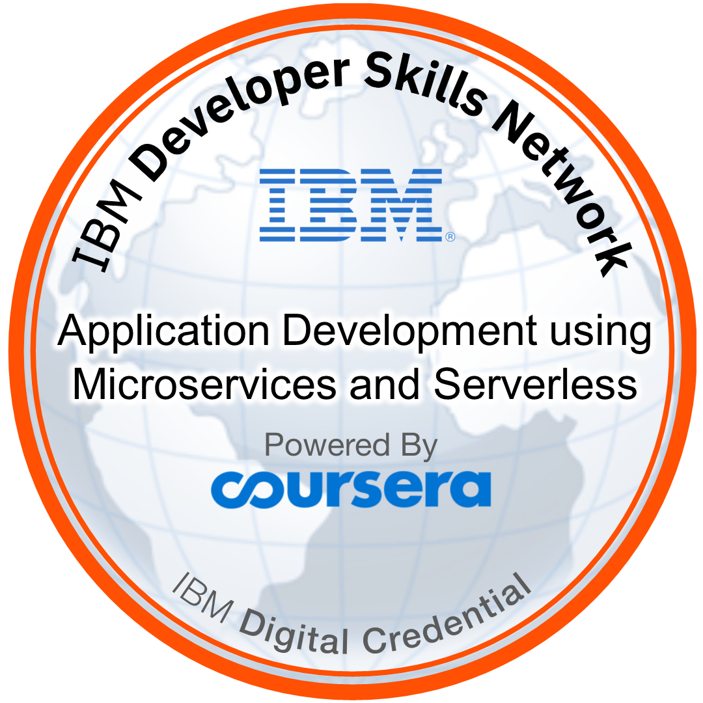

<!--  Profile Widget  -->

<!-- Reference: https://github.com/Jurredr/github-widgetbox -->

<!-- -------Header------- -->

  

<!--  -->

<!-- Bio -->

- 👋 Hello! I'm Richard Collins, a Software Engineer with a strong foundation and notable projects.
- 💪 I specialize in Web Development and Blockchain, currently working as a Full Stack Engineer.
- ⚙️ My advanced skills include React, Angular, Next.js, Golang, Node.js, Solana, MongoDB, MySQL, and SQL WorkBench.
- 🌱 I love to tackle complex Data Structures and Algorithms problems on **[Leetcode](https://leetcode.com/umairazmat/)**.
- 🌱 And also expanding my knowledge in DevOps, focusing on Docker, Kubernetes, and CI/CD.
- 👯 I’m eager to collaborate with other content creators and developers.
- 🥅 2024 Goals: To study new technologies and stay ahead in the ever-evolving software development landscape.
- 📩 Don't hesitate to reach out & let's connect and start a conversation. 📞
- 🤝 Let's connect and explore how I can contribute to your projects or provide valuable insights. Together, we can create remarkable digital solutions that leave a lasting impact. 💼✨

<!--  -->

<!-- ## 🤝🏻 &nbsp;Connect with Me

 -->

<h2><i>⚙️ GitHub Analytics</i></h2>
    

        
        
    

<!-- quote -->

<!-- reference = https://github.com/PiyushSuthar/github-readme-quotes -->
 
<!-- 

 

  

 -->

<h2><i>🏅 Awards &  Badges</i></h2>

   

   

   

   

   

   

   

## 🧑‍💻 Tech Stack 🛠️

<!-- tech stack -->

<!-- reference = https://github.com/tandpfun/skill-icons -->
 

  

